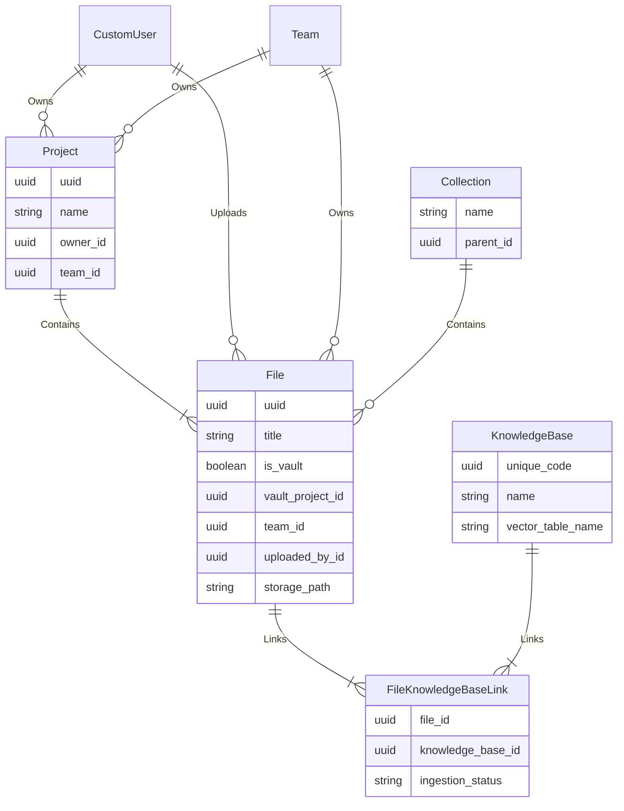

# Vault Feature: Data Model

This document provides a detailed overview of the PostgreSQL database schema supporting the Vault feature. The schema is defined using the Django ORM and is designed to be relational, secure, and extensible.

## 1. Entity-Relationship Diagram (Conceptual)

This diagram shows the core relationships between the main tables involved in the Vault feature.

## 2. Table Definitions

Below are detailed descriptions of the key tables (Django models) that constitute the Vault's data model.

### `Project` (`reggie_project`)

Stores information about a project, which acts as a container for grouping files and managing access.

-   **Purpose:** To organize related documents for a specific matter or purpose.
-   **Key Columns:**
    -   `uuid` (PK): A unique identifier for the project.
    -   `name` (varchar): The user-defined name of the project.
    -   `owner_id` (FK to `CustomUser`): The user who owns the project.
    -   `team_id` (FK to `Team`): The team that this project belongs to, forming the basis of shared access.
    -   `members` (M2M to `CustomUser`): Explicitly grants access to individual users who may not be on the project's primary team.

### `Collection` (`reggie_collection`)

Enables the creation of a hierarchical folder-like structure for organizing files within or outside of projects.

-   **Purpose:** To provide a familiar and flexible folder-based organization system for documents.
-   **Key Columns:**
    -   `uuid` (PK): A unique identifier for the collection.
    -   `name` (varchar): The name of the folder.
    -   `parent_id` (Self-referential FK): A link to the parent `Collection`, allowing for nested folders. If `NULL`, it is a root-level folder.

### `File` (`reggie_file`)

This is the central table, representing a single document uploaded to the system.

-   **Purpose:** To store all metadata for a specific document, including its identity, location, ownership, and status.
-   **Key Columns:**
    -   `uuid` (PK): The primary unique identifier for the file.
    -   `title` (varchar): The display title of the file.
    -   `storage_path` (varchar): The full path to the raw file in the object store (e.g., `gs://bucket-name/path/to/file.pdf`). This decouples the metadata from the physical file.
    -   `is_vault` (boolean): A flag to indicate if this file is part of the Vault, which may trigger different UI treatments or processing rules.
    -   `vault_project_id` (FK to `Project`): Links the file to a specific Vault project.
    -   `collection_id` (FK to `Collection`): Places the file within the hierarchical folder structure.
    -   `team_id` (FK to `Team`): The team that owns this file. This is a key field for enforcing data isolation.
    -   `uploaded_by_id` (FK to `CustomUser`): The user who uploaded the file.
    -   `is_ingested` (boolean): A status flag indicating if the file has been successfully processed and embedded into at least one knowledge base.
    -   `knowledge_bases` (M2M to `KnowledgeBase`): A many-to-many relationship defining which knowledge bases this file should be ingested into.

### `KnowledgeBase` (`reggie_knowledgebase`)

Represents a logical container for a set of vectorized documents. A knowledge base is configured with a specific embedding model.

-   **Purpose:** To define a space where documents can be embedded and searched using a consistent model and configuration.
-   **Key Columns:**
    -   `unique_code` (PK): A unique identifier for the knowledge base.
    -   `name` (varchar): A user-friendly name for the KB.
    -   `vector_table_name` (varchar): The name of the physical table in PostgreSQL where the vectors for this KB are stored (e.g., `kb_production_vectors`).
    -   `model_provider_id` (FK to `ModelProvider`): Specifies which embedding model (e.g., `text-embedding-ada-002`) is used for this KB, ensuring vector consistency.

### `FileKnowledgeBaseLink` (`reggie_fileknowledgebaselink`)

A linking table that tracks the ingestion status of a specific file into a specific knowledge base.

-   **Purpose:** To manage the many-to-many relationship between files and knowledge bases and to store the state of the ingestion process for each link.
-   **Key Columns:**
    -   `file_id` (FK to `File`): The file being ingested.
    -   `knowledge_base_id` (FK to `KnowledgeBase`): The target knowledge base for ingestion.
    -   `ingestion_status` (varchar): The current status of the ingestion (e.g., `pending`, `processing`, `completed`, `failed`).
    -   `ingestion_error` (text): Stores any error message if the ingestion fails.

## 3. The Vector Table (Conceptual)

The vector data itself is stored in a table managed by `pgvector`, not directly by the Django ORM. Conceptually, its schema looks like this:

-   **Table Name:** Defined by `KnowledgeBase.vector_table_name`.
-   **Purpose:** To store the vector embeddings and the metadata required for fast, secure, and filtered similarity searches.
-   **Conceptual Columns:**
    -   `id` (uuid): A unique identifier for each vector chunk.
    -   `embedding` (vector): The numerical vector representation of the text chunk. This column is indexed with an HNSW index for fast searching.
    -   `metadata` (jsonb): A JSON object containing all the metadata associated with the vector. This is **critical for security and filtering**.
        -   `file_uuid`: The UUID of the source `File`.
        -   `team_id`: The UUID of the owning team.
        -   `project_id`: The UUID of the associated project.
        -   `user_id`: The UUID of the uploading user.
    -   `content` (text): The raw text of the document chunk corresponding to the embedding.

The `metadata` column is indexed to allow the database to efficiently perform filtered vector searches, forming the core of the multi-tenant security model.
